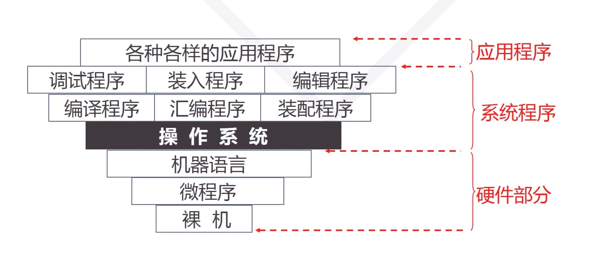
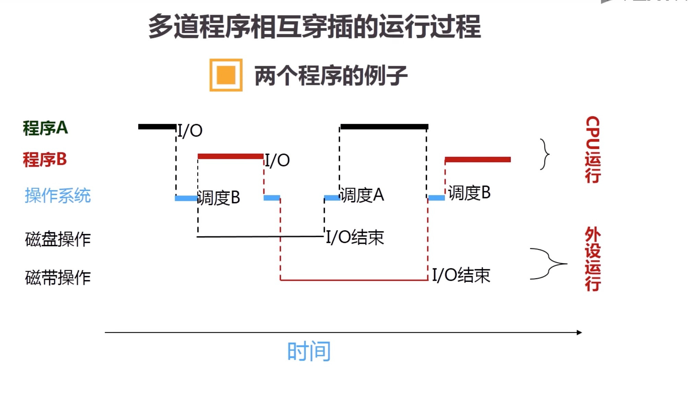

# 常见操作系统
  * windows
  * linux
  * mac os

# 基本功能
  * 提供操作界面
  * 控制程序运行
  * 管理系统资源
  * 配置系统参数
  * 监控系统状态
  * 工具软件集合

# 进程管理
  * 进程控制
    * 创建
    * 暂停
    * 撤销
    * 唤醒
  * 进程调度
    * 调度策略
    * 优先级
  * 进程通信
    * 进程间通信

# 内存管理
  * 内存分配
  * 内存共享
  * 内存保护
  * 虚拟内存

# 设备管理
  * 设备的分配和调度
  * 实现设备无关性
  * 设备传输控制
  * 设备驱动

# 文件管理
  * 存储空间管理
  * 文件操作
  * 目录的操作
  * 文件和目录的存取权限管理

# 操作系统的定义
  * 操作系统是一个大型系统程序
    * 提供用户接口，方便用户控制计算机
    * 负责为应用程序分配和调度软硬件资源，并控制与协调应用程序并发活动，帮助用户存取和保护信息

# 计算硬件发展的四个典型阶段
  * 电子管时代 [1946 - 1955]
    * 硬件: 电子管、接线面板(开关、按钮)
    * 软件: 二进制程序、打孔、纸袋、卡片
    * 特点: 程序准备/启动/结束:手工处理、繁琐耗时
  * 晶体管时代 [1955 - 1965]
    * 单道批处理系统
    * 多道批处理系统
      * 多道、宏观并行、微观串行

  * 集成电路时代 [1965 - 1980]
  * 大规模集成电路时代 [1980 - 现在]

<pre>速度、容量、稳定性、可靠性都得到大幅度的提升</pre>

# 分时系统
##  出现的背景因素
  * 60 年代硬件的两个重大进展
    * 中断技术
    * 通道技术
  * 事务性任务的涌现
    * 交互性高
    * 响应快速
  * 要求支持多任务、多用户
  * 多终端计算机
## 分时技术
  * 主机以很短的"时间片"为单位，把cup轮流分配给每个终端使用，直到全部作业被运行完
  * 由于时间片很短，在终端不多的情况下，每个终端都能很快重新获得cpu，是的每个终端都能得到及时响应
    * 等待周期 = 时间片 x 终端数量
## 特点
  * 多路调制性
    * 多用户联机使用同一台计算机
  * 独占性
    * 用户感觉独占计算机
  * 交互性
    * 及时响应用户的请求

## 大型分时系统的实践: Multics 项目

## 第一个实用化的分时操作系统 UNIX
  * 第一个真正体现操作系统领域各种先进概念和技术的操作系统
  * 革新和创造
    * 实现操作系统和可移植性
    * 实现了硬件无关性
    * 引进了 “特殊文件 (Specail File) 的概念
      * 把外设看作文件，实现对外社的统一管理

# 典型操作系统类型(分时操作系统的衍化)
  * 微机操作系统
  * 多处理机操作系统
  * 网络操作系统
  * 实时操作系统
  * 嵌入式操作系统

# 适合学习的小型开源操作系统
  * Minix OS
    * Andrew S. Tanenbaum 编写
    * 荷兰 阿姆斯特丹 Vrije 大学计算机科学院
    * 开放源代码给教学和科研人员
    * Minix = Mini UNIX (~ 12,000 行代码)
    * 微内核架构(Microkernel)
    * 类 UNIX 操作系统

