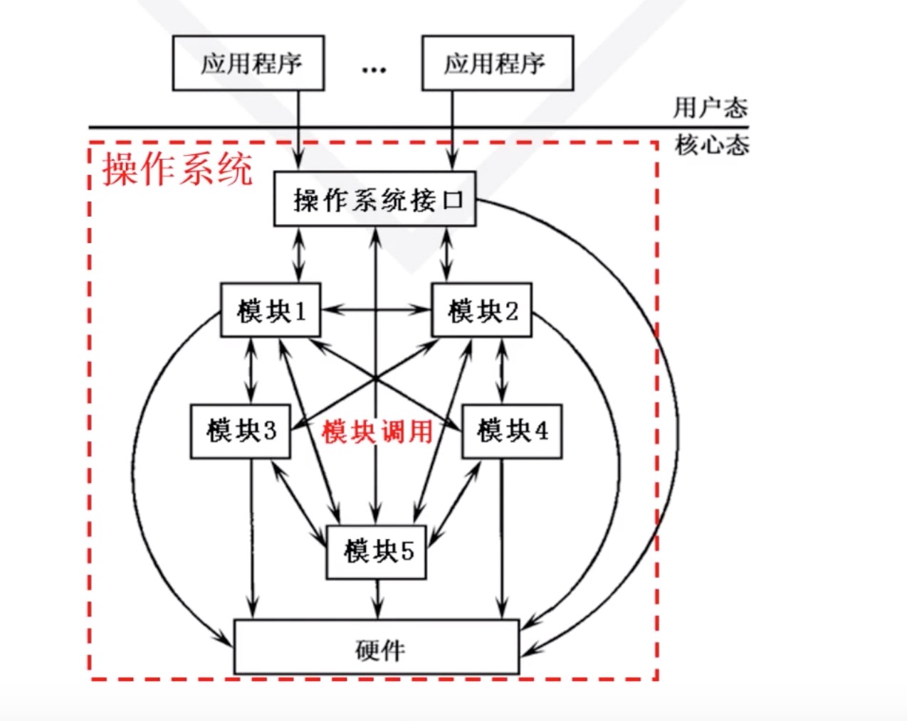
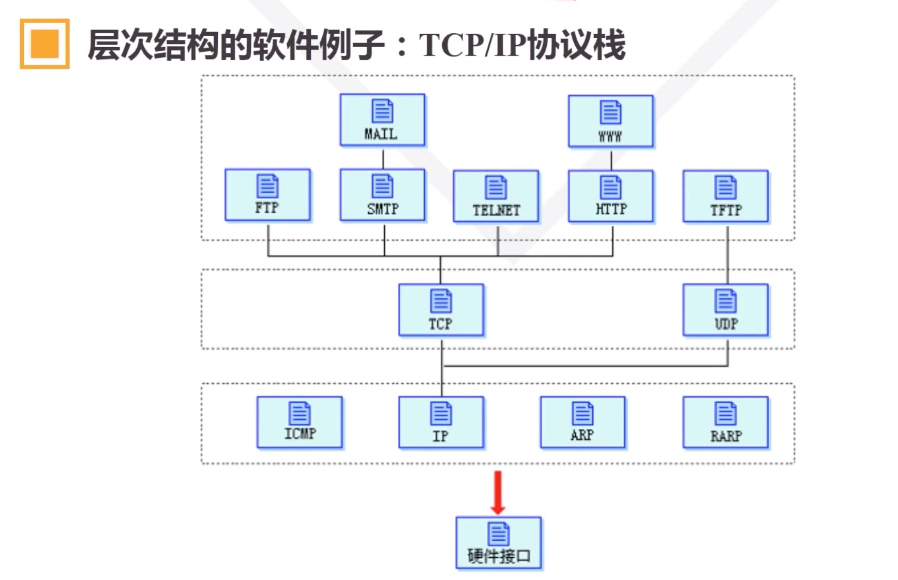
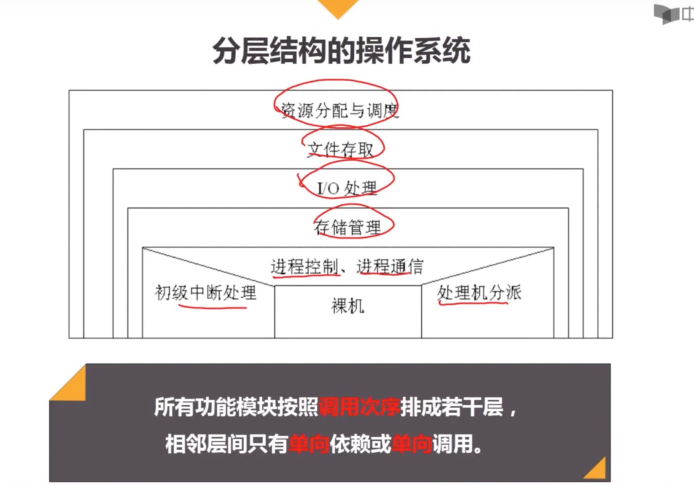
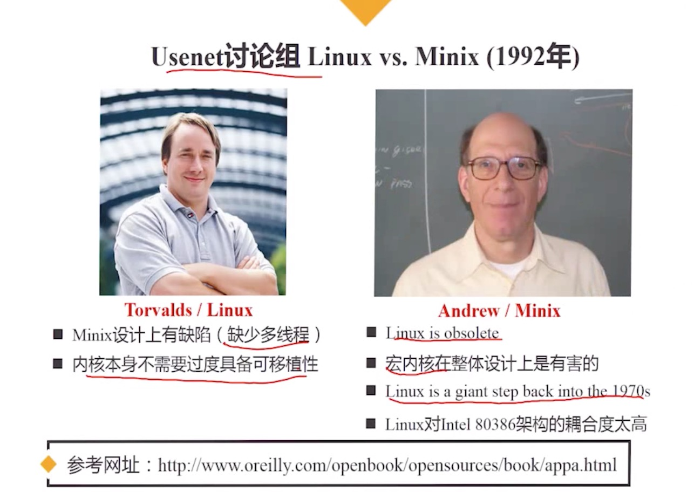
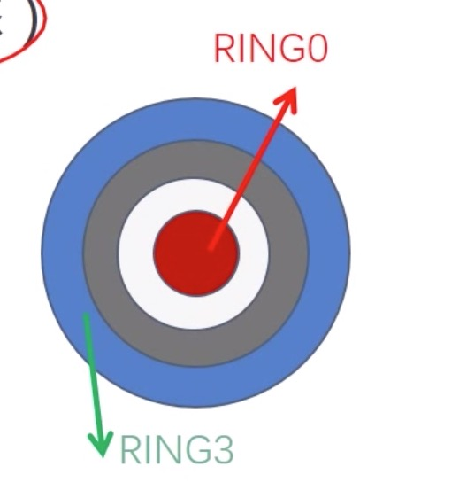
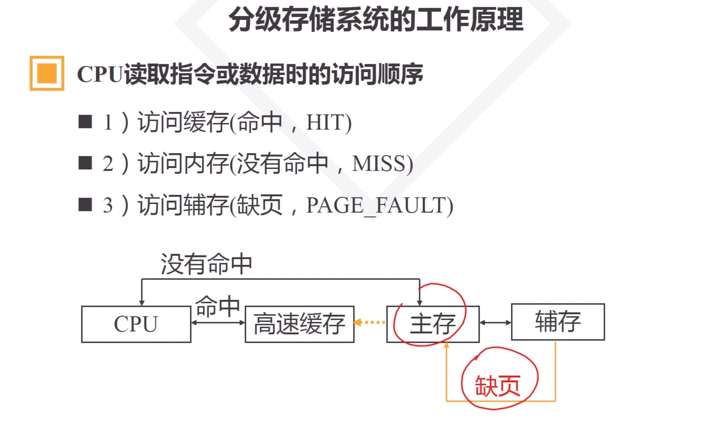

# 操作系统的逻辑结构
------------------

# 逻辑结构
  * os 的设计和实现思路

# 种类
  * 整体式结构
    * 以模块为基本单位构建
    * 特点
      * 模块设计、编码、调试独立
      * 模块调用自由
      * 模块通信多以全局变量形式完成
    * 缺点
      * 信息传递随意、维护和更新困难

  * 层次结构
    * 分层的原则
      * 硬件相关 - 最底层
      * 外部特性 - 最外层
      * 中间层 - 调用次序或者消息传递
      * 共性服务 - 较低层
      * 活跃功能 - 较低层
    * 有点
      * 结构清晰，避免循环调用
      * 整体问题局部化，系统的正确性容易保证
      * 有利于操作系统的维护、扩充、移植

  * 微内核结构
    * 操作系统 = 微内核 + 核外服务器
    * 微内核
      * 足够小，提供os最基本、最核心、共性的功能和服务
      * 实现与硬件紧密相关的处理
      * 实现一些较基本的功能
      * 负责客户和服务器间到的通信
    * 核外服务器
      * 完成os的绝大部分服务功能，等待应用程序提出请求
      * 由若干服务器或者进程共同构成, 例如： 进程、线程服务器, 虚存服务器, 设备管理服务器 以进程形式运行在用户态

# 支持操作系统的最基本硬件结构
  * CPU 态(Mode)
    * CPU 的工作状态
    * 对资源和指令使用权限的描述
    * 特权指令
      * LGDT/LIDT: 装载特殊寄存器
      * CLTS: 清除任务开关标志
      * STI/CTI: 允许和禁止中断
      * HALT: 停止 CPU 的工作
      * IN/OUT: 执行 I/O 操作
      * 从核态转回到用户态
      * ...
    * 态的分类
      * 核态(Kernel mode): 能够访问所有资源和执行所有指令, 管理程序、OS内核
      * 用户态(User mode 目态): 仅能访问部分资源，其他资源受限。执行用户程序
      * 管态(Supervisor mode): 介于核态和用户态之间
    * 用户态向核态转换的情形
      * 用户请求 OS 提供服务
      * 发生中断
      * 用户进程产生错误(内部中断)
      * 用户态企图执行特权指令
    * 核态向用户态转换的情形
      * 一般是执行中断返回: IRET

    * 硬件和OS对CPU的观察
      * 硬件按 "态" 来区分 CPU 的状态
      * OS 按 "进程" 来区分 CPU 的状态
    * Intel CPU 的太
      * Ring0 - Ring3 (Ring0 最核心，Ring3 最外层)
      * 程序段 A 访问程序段 B 时进行权限检查(态)
      * 程序段: 请求特权级， RPL
        * Requested Privilege Level
        * RPL=0..3
      * 描述符特权级, DPL
        * Descriptor Privilege Level
        * DPL=0..3

  * 内存

  * 中断
    * 指 CPU 对突发的外部事件的反应过程或机制
    * CPU 收到外部信号(中断信号)后，停止当前的工作，转去处理该外部事件，处理完毕后回到原来的中断处(断点)继续原来的工作

    * 引入中断的目的
      * 实现并发活动
      * 实现实时处理
      * 故障自动处理
    * 中断源
      * 引起系统中断的事件称为中断源
    * 中断类型
      * 强迫性中断: 程序没有预期，例如: I/O, 外部中断
      * 自愿中断: 程序有预期的，例如: 执行访管指令
      * 外中断： 由 CPU 外设事件引起， 例如: I/O, 外部事件
      * 内中断： 由 CPU 内部事件引起，例如: 访管中断、程序中断
    * 断点
      * 程序中断的地方，将要执行的下一指令的地址
      * CS:IP
    * 现场(上下文 context)
      * 程序正确运行所依赖的信息集合
      * 相关寄存器
    * 现场的两个处理过程
      * 现场保护: 进入中断服务程序之前，入栈
      * 现场恢复: 退出中断服务程序之后，出栈
    * 中断响应过程
      * 识别中断源
      * 保护断点和现场
      * 装入中断服务程序的入口地址(CS:IP)
      * 进入中断服务程序
      * 恢复现场和断点
      * 中断返回: IRET
    * 中断响应的实质
      * 交换指令执行地址
      * 交换 CPU 的态
      * 工作 现场保护和恢复、参数传递(通信)
  * 时钟

